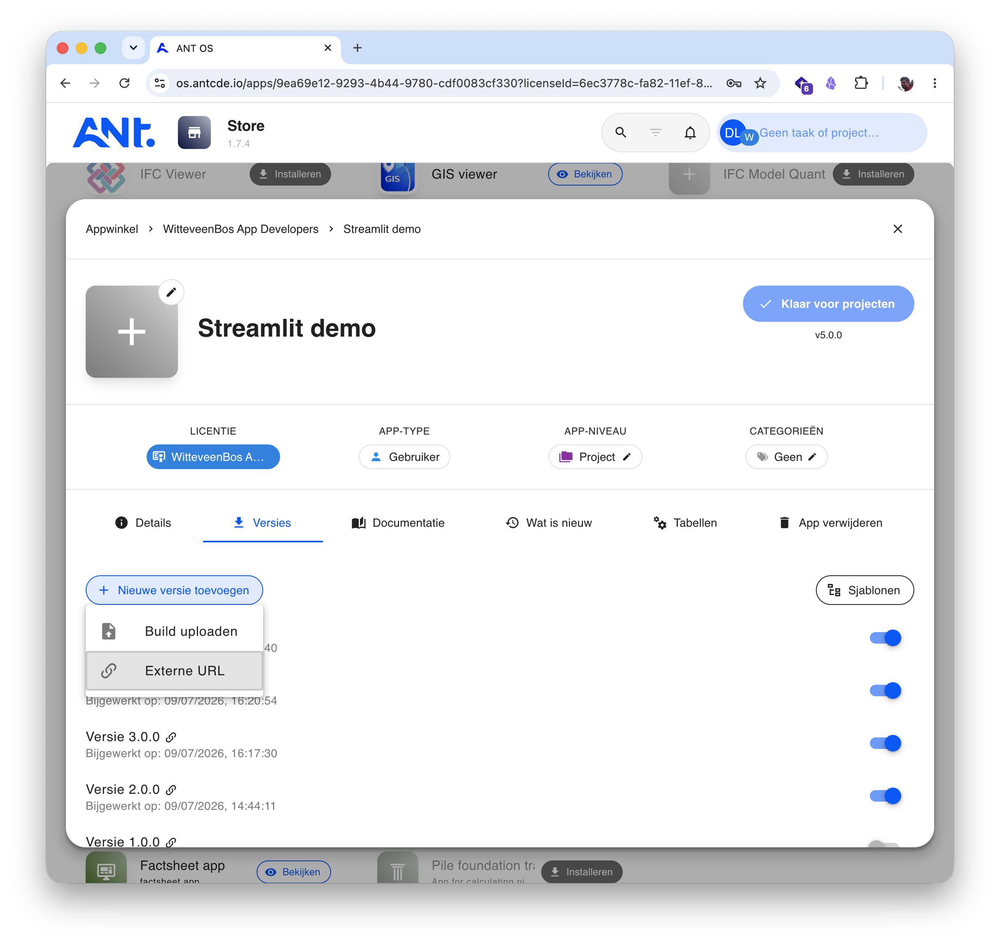

# ant-connect-streamlit-demo

Demo Streamlit app that runs inside ANT-OS, showcasing the full `ant-connect-streamlit` API.

## Features demonstrated

- **Context** — reads user, license, project, task from the ANT-OS host
- **Signals** — toggle notepad, show overlay, navigate to routes/apps
- **Notifications** — success, error, warning, info toasts via host
- **Toolbar** — set title, subtitle, menu items with actions
- **HTTP proxy** — fetch project data through the host's authenticated Axios

## Quick start

```bash
# Clone
git clone https://github.com/ANTCDE/ant-connect-streamlit-demo.git
cd ant-connect-streamlit-demo

# Install (requires uv — https://docs.astral.sh/uv/)
uv sync

# Run
uv run streamlit run app.py
```

The app runs on `http://localhost:8501` by default. In ANT-OS, load it via Developer mode at `/developer/8501`.

## Publishing

A Streamlit app cannot be packaged as an ANT-OS build zip — it needs a running
Python server. Instead you host it somewhere and register the URL as an
**External URL** version in the ANT-OS App Store. Two hosting options:

### Option A — Streamlit Community Cloud

1. Push the app to a public GitHub repository with a `requirements.txt`
   (pin `ant-connect-streamlit` to a commit for reproducible deploys):

   ```
   streamlit>=1.30.0
   ant-connect-streamlit @ git+https://github.com/ANTCDE/ant-connect-streamlit.git@<commit-sha>
   ```

2. Go to [streamlit.io/cloud](https://streamlit.io/cloud), sign in with GitHub
   and deploy the repository. You get a URL like
   `https://<your-app>.streamlit.app/`.

3. **Append `?embed=true` to the URL.** Without it, streamlit.app refuses to
   load inside the ANT-OS iframe (endless redirect loop):

   ```
   https://<your-app>.streamlit.app/?embed=true
   ```

Community Cloud redeploys automatically on every push to the repository. Note
that it only reinstalls dependencies when `requirements.txt` changes — bump the
pinned `ant-connect-streamlit` sha to pick up library updates.

### Option B — Self-hosting with Docker

Any server that can run a container works. Example `Dockerfile`:

```dockerfile
FROM python:3.12-slim

# git is needed to pip-install ant-connect-streamlit from GitHub
RUN apt-get update \
    && apt-get install -y --no-install-recommends git \
    && rm -rf /var/lib/apt/lists/*

WORKDIR /app
COPY requirements.txt .
RUN pip install --no-cache-dir -r requirements.txt
COPY . .

EXPOSE 8501
CMD ["streamlit", "run", "app.py", \
     "--server.port=8501", \
     "--server.address=0.0.0.0", \
     "--server.headless=true"]
```

```bash
docker build -t ant-streamlit-demo .
docker run -p 8501:8501 ant-streamlit-demo
```

Put it behind HTTPS (ANT-OS runs on HTTPS, so the iframe source must too) and
use the public URL directly — self-hosted Streamlit embeds fine without
`?embed=true`, though adding it still hides the Streamlit toolbar.

### Registering the URL in the ANT-OS App Store

1. Open the **Store** app in ANT-OS and create (or open) your app.
2. Go to the **Versions** tab and click **Add new version** → **External URL**.
3. Paste the app's URL — for Community Cloud, including `?embed=true`.



Every new deployment URL (or a change like adding a query parameter) needs a
new version. Users get the new version through the store; the iframe loads the
URL exactly as entered.

## Requirements

- Python >= 3.11
- ANT-OS host (the app runs inside an ANT-OS iframe)
